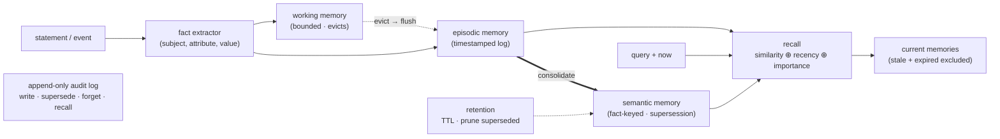

# agent-memory-service

[](https://github.com/axiom-orion/agent-memory-service/actions/workflows/ci.yml)

A typed, provenance-tracked **memory layer for LLM agents** — the substrate an agent platform needs to carry knowledge across sessions. It implements the four stores of the standard cognitive-memory taxonomy (working / episodic / semantic / procedural), distils episodic events into semantic facts via **consolidation**, retrieves with recency-aware scoring, **forgets** via TTL and supersession, and writes every operation to an **append-only audit log** for explainability.

It is built to make one failure mode measurable: **naive "append everything to a vector store" agent memory returns stale facts when facts change over time.** On a synthetic interaction history where some facts are updated across sessions, a flat vector store answers current-fact queries correctly at rank 1 **0%** of the time and surfaces a stale value in the top-5 **100%** of the time; the full memory service reaches **100%** current-fact accuracy with **0%** staleness — while cutting the tokens needed to ground an answer by ~35%.

Everything runs on CPU, no external services. The numbers below are produced by `eval/run_eval.py`, not asserted.

---

## Results

42 interactions (32 fact statements, 10 noise) · 12 gold queries (7 changing facts, 5 stable) · embeddings `all-MiniLM-L6-v2`. Each rung adds one capability. ↑ higher better, ↓ lower better.

| memory policy | acc@1 ↑ | found@5 ↑ | stale@5 ↓ | ctx tokens ↓ |
|---|---|---|---|---|
| flat-vector | 0.417 | 0.833 | 0.583 | 32.5 |
| +recency | 0.667 | 0.917 | 0.583 | 35.0 |
| +consolidation | 0.833 | 1.000 | 0.583 | 21.6 |
| **+supersession (full)** | **1.000** | **1.000** | **0.000** | **21.2** |

The point is sharpest on **changing facts** — the ones whose value was updated over the timeline:

| memory policy | acc@1 ↑ | stale@5 ↓ |
|---|---|---|
| flat-vector | 0.000 | 1.000 |
| +recency | 0.429 | 1.000 |
| +consolidation | 0.714 | 1.000 |
| **+supersession (full)** | **1.000** | **0.000** |

Stable facts (name, home city, employee ID) score **1.000 acc@1 under every policy** — the service adds no regression on what flat retrieval already handles.

### How to read this

- **A flat vector store cannot tell current from stale.** "Who is my current manager?" never contains the answer; the store holds two "Alice Reyes" statements (the old value, stated twice) and one "Bob Tran" (the current value). They are near-equally similar to the query, so rank-1 accuracy on changing facts is **0.000** and a stale value is in the top-5 **every time**. This is the single most common defect in hand-rolled agent memory.
- **Recency helps, but it is a blunt instrument.** Weighting newer memories higher lifts changing-fact accuracy to 0.429 — but it cannot be turned up far without burying *old-but-stable* facts under recent noise, so it never removes stale values (stale@5 stays 1.000). Recency is a tiebreaker, not a correctness mechanism.
- **Consolidation gets the current value to rank 1** (0.714) by collapsing repeated statements into terse semantic facts and letting recency break ties — and it cuts context tokens **32.5 → 21.6** because the agent grounds on one-line facts instead of verbose logs. But without supersession the deduped *old* values still coexist, so stale@5 remains 1.000: the stale fact is still retrievable, just lower.
- **Supersession is the correctness mechanism.** Keying semantic facts on `(subject, attribute)` and marking superseded values inactive means the only candidate for a changed fact is its current value: acc@1 **1.000**, stale@5 **0.000**. The superseded values are not deleted — they are retained, marked, and queryable through the audit log, which is what an auditable/regulated deployment requires.
- **Honest note on tuning:** the recency weight (0.25) was chosen so a strong similarity match isn't overturned by recent noise; it was not tuned to the gold answers, and the supersession result is recency-independent (once stale values are inactive, the current value is the only candidate for that key regardless of weighting).

---

## Benchmark: LoCoMo-10

Beyond the synthetic ablation, the retriever is evaluated on **LoCoMo** (Maharana et al., 2024) — the field-standard long-term-conversation memory benchmark that Mem0, Zep, and Letta report on. The public LoCoMo-10 set is 10 multi-session conversations (5,882 dialogue turns here), with QA labeled by category and annotated with the gold *evidence* turns each answer depends on.

`make locomo-data && make locomo` ingests each conversation into the memory service and measures **retrieval recall of the gold evidence turns** — deterministic, no API key, reproducible by anyone:

| metric | value | | category | recall@5 | recall@10 |
|---|---|---|---|---|---|
| recall@1 | 0.162 | | multi-hop | 0.188 | 0.269 |
| recall@5 | 0.366 | | temporal | 0.415 | 0.492 |
| recall@10 | 0.454 | | open-domain | 0.186 | 0.254 |
| recall@20 | 0.545 | | single-hop | 0.427 | 0.523 |
| MRR@10 | 0.286 | | | | |

1,536 questions scored (categories 1/2/3/4, which carry gold evidence; adversarial category 5 excluded). Single-hop and temporal questions are recovered far more often than multi-hop, as expected for a single-vector retriever.

**Honest scope.** This isolates the **embedding/retrieval layer** on real long conversations with a small CPU model (`all-MiniLM-L6-v2`); the absolute recall reflects that model, not a ceiling. It is **not** a supersession result — recency, consolidation, and supersession target *current-fact* accuracy, which is measured end-to-end by `make locomo-qa` (answer F1 using LoCoMo's official token-F1, verified byte-identical to upstream in `tests/test_locomo_metrics.py`; answer generation requires an API key, and `EXTRACT=1` routes turns through fact extraction → consolidation → supersession). LoCoMo token-F1 is the original-paper metric and is not directly comparable to the LLM-judge "accuracy" some vendors publish.

---

## Serving & deployment (Cloud Run)

<!-- LIVE_URL_START -->
**Live demo:** [`https://agent-memory-service-voiwkzrlma-uc.a.run.app`](https://agent-memory-service-voiwkzrlma-uc.a.run.app) — a rate-limited, read-only API over a bundled synthetic corpus, on Cloud Run (`us-central1`, scale-to-zero).

```bash
curl -s -X POST https://agent-memory-service-voiwkzrlma-uc.a.run.app/recall \
  -H 'content-type: application/json' -d '{"query":"Who is my current manager?","k":3}'
# -> {"records":[{"id":5,"content":"current manager: Bob Tran","type":"semantic",...}]}
curl -s https://agent-memory-service-voiwkzrlma-uc.a.run.app/stats   # -> {"active":22,"superseded":10}
```

(First request after idle cold-starts the container — it loads MiniLM, so allow a few seconds.)
<!-- LIVE_URL_END -->

`serve/app.py` exposes the memory service over HTTP. The public, **rate-limited, read-only** surface serves a **bundled synthetic corpus** (never user data):

```
POST /recall   { query, k? }  -> { records: [{ id, content, type, importance, superseded }] }
GET  /stats                    -> { active, superseded }
GET  /health                   -> liveness + active embeddings backend
```

Mutating and admin routes (`/admin/rebuild`, `/remember`, `/ingest`, `/consolidate`, `/forget`) are **Bearer-guarded** via `ADMIN_TOKEN` (injected from Secret Manager, never baked into the image; routes return `503` when it is unset). There is **no background maintenance thread** — Cloud Run freezes idle CPU — so the index is rebuilt on write and by `POST /admin/rebuild`, which a **Cloud Scheduler** job calls on a cadence (`VectorIndex.rebuild(*store.get_active_vectors())`).

Two embedding backends: `local` (`all-MiniLM-L6-v2`, baked into the image) and `vertex` (Vertex AI text-embeddings, `EMBEDDINGS_BACKEND=vertex`). The `Dockerfile` builds a non-root, `$PORT`-binding, hash-pinned image; **[DEPLOY.md](DEPLOY.md)** is the step-by-step. `bench/loadtest.py` measures `/recall` latency and throughput against any URL; `bench/costmodel.py` converts a measured latency into $/1k requests.

Local baseline — this container (one shared CPU, MiniLM, in-memory, 500 memories, 32-way concurrency), as a sanity anchor, **not** a Cloud Run figure:

| p50 | p90 | p99 | throughput |
|---|---|---|---|
| 409 ms | 545 ms | 939 ms | ~80 req/s |

Latency here is dominated by CPU-bound embedding under concurrency on a single core; the `vertex` backend offloads embedding and Cloud Run provides dedicated CPU + autoscaling. Deploy and run `bench/loadtest.py` against the live URL for real deployed p50/p99. The in-memory store is single-instance by design — durable memory (pgvector/Supabase or Vertex Vector Search) is the documented production extension.

### Consumed by flcason.com (the Keeper)

The genealogy "Keeper" on [`flcason.com`](https://flcason.com) is a real consumer of this
contract. Its weekly research pass is otherwise stateless; pointed at a deployment of this
service it gains **durable memory of its own past runs** — at the start it `POST /recall`s
what earlier runs found about each open line, and at the end it `POST /ingest`s the run's
findings keyed on `(subject = personId, attribute = the open line)` and `POST /consolidate`s,
so a later corroborated finding **supersedes** the stale one rather than both lingering. The
client is a dependency-free `fetch` wrapper (`ui_kits/living-line/memory-client.js` in
`cason-heritage`), env-gated (`KEEPER_MEMORY_URL` + `KEEPER_MEMORY_TOKEN`) and graceful: a
memory outage degrades the Keeper to its stateless behaviour rather than failing the run.
`recall` uses the public surface; `ingest`/`consolidate` use the Bearer admin routes. This is
the agent-platform use the four-store taxonomy was built for — supersession is what keeps the
Keeper from re-proposing a lead it already settled.

---

## Architecture



| component | file | role |
|---|---|---|
| stores | `stores.py` | `WorkingMemory` (bounded, importance-eviction), `EpisodicMemory` (append log), `SemanticMemory` (fact-keyed + supersession), `ProceduralMemory` |
| consolidation | `consolidation.py` | episodic fact statements → semantic facts; dedupe; supersede prior values |
| scoring | `scoring.py` | `w_sim·cosine + w_rec·exp(-age/τ) + w_imp·importance` |
| retention | `retention.py` | TTL expiry, pruning of superseded facts past a grace window |
| audit | `audit.py` | append-only operation log (the explainability substrate) |
| extractor | `extractor.py` | structured passthrough; optional Anthropic LLM extraction (production) |
| index | `vector_index.py` | FAISS `IndexIDMap2` over int64 ids; exact `IndexFlatIP` by default (HNSW opt-in); `rebuild()` from the active set, `remove()` on flat |
| service | `service.py` | `remember` / `consolidate` / `recall` / `forget` facade; owns the str↔int id map, `get_active_vectors()`, and `rebuild_index()` |

---

## Quickstart

```bash
python -m pip install -e ".[dev]"      # or: make setup
python data/generate_sessions.py       # make gen-data
python eval/run_eval.py                # make eval   (the ablation above)
pytest -q                              # make test
python scripts/demo.py "Who is my current manager?"
```

`demo.py` output — the answer plus the lineage behind it:

```
Q: Who is my current manager?

Recalled memories (current, stale suppressed):
  [1] current manager: Bob Tran   (user.current_manager=Bob Tran; support=1; from 1 source(s))
  ...
Superseded prior values for current_manager:
  - Alice Reyes  (provenance ['M0010', 'M0011'])
```

The agent answers with the current value; the prior value is retained, attributed to its source statements, and explained — not silently dropped.

---

## Memory lifecycle

- **remember(content, day, subject/attribute/value, importance, ttl)** — write to episodic (and working) memory; embed; audit. A statement with a `(subject, attribute)` triple is a fact candidate; free text is a non-fact episodic memory.
- **consolidate(now)** — group episodic facts by key; under supersession keep only the latest value active and mark earlier ones superseded; otherwise dedupe identical values. Terse semantic facts replace verbose repetition.
- **recall(query, k, now)** — shortlist by embedding similarity, then re-rank by `similarity ⊕ recency ⊕ importance`; **superseded and TTL-expired items are excluded** from candidates.
- **forget(now)** — drop TTL-expired memories and prune superseded facts past a grace window; audited. Superseded-but-recent facts are retained for history/audit.

---

## Production backends

The reference build is in-memory (FAISS + Python) so the eval is reproducible with zero setup. The interfaces map onto production stores without changing call sites: working memory → Redis with TTL; episodic/semantic vector stores → pgvector / Pinecone / Vertex AI Vector Search; the audit log → an append-only table or event stream. The `extractor.LLMExtractor` sketches the Anthropic-backed path that populates `(subject, attribute, value)` from free-text turns; the eval uses the structured passthrough so CI needs no key or network.

---

## Scope and honest notes

- **Synthetic data, deterministic** (`SEED=23`): no real-person PII, and every gold answer is derivable from the generated timeline. The scenario is small (42 interactions, 12 queries) — enough to separate the policies cleanly and run fast/deterministically, not a claim about behaviour at production scale. The FAISS index and batched embedding cache are there so the same code scales.
- **Fact extraction is upstream.** The eval assumes structured `(subject, attribute, value)` triples (as if emitted by an agent or the optional LLM extractor). Free-text fact extraction quality is its own problem and is out of scope for this measurement.
- **"Provenance" means source attribution + an operation audit trail** — which statements back a fact and what happened to it — not a cryptographic proof-chain.
- **Consolidation here is rule-based** (group-by-key, latest-wins). Semantic summarisation/clustering of non-fact episodic memories and an LLM answer-synthesis layer over the recalled, cited context are the natural next extensions.

---

## Related work

The supersession mechanism here — keep the latest value per `(subject, attribute)`, mark prior values inactive, and retain them for audit rather than deleting — is the same principle temporal knowledge-graph memory systems implement as **bi-temporal fact invalidation**. Zep / Graphiti track `valid_at` / `invalid_at` (plus ingestion and expiry times) on each fact edge and *invalidate rather than delete* when a fact changes, so a query returns what is true now while history stays auditable. This service applies that principle in a typed-store form with a deterministic group-by-key consolidation step instead of LLM-extracted graph edges, and the eval isolates the property those systems are built around — returning the *current* value of a changed fact — and measures it directly across policies.

---

## Repository layout

```
agent-memory-service/
├── data/
│   ├── generate_sessions.py      # deterministic interaction history + gold queries
│   └── sessions/                 # interactions.jsonl, queries.jsonl  (committed)
├── src/agent_memory/
│   ├── types.py  config.py  embeddings.py  scoring.py  vector_index.py
│   ├── stores.py                 # working / episodic / semantic / procedural
│   ├── consolidation.py  retention.py  audit.py  extractor.py  service.py
├── eval/      # run_eval.py, queries.jsonl, results.md, results.json
├── tests/     # pytest: stores, consolidation, audit, retrieval properties
├── scripts/   # demo.py
├── Makefile   pyproject.toml   requirements.txt   .github/workflows/ci.yml
```

MIT-licensed. CI runs lint, tests, and the full ablation on every push.

---

## Context

Part of [**axiom-orion**](https://github.com/axiom-orion) — small, eval-driven engineering pieces that each turn one hand-waved claim into a reproducible number. The provenance-tracking, supersession, and audit discipline shown here is the same principle the [**Vorion**](https://github.com/vorionsys) governed-AI platform (`@vorionsys/*`) applies to autonomous agents: keep what's true now, retain what changed, and prove the lineage. Built by [Ryan Cason](https://github.com/vorionsys).
